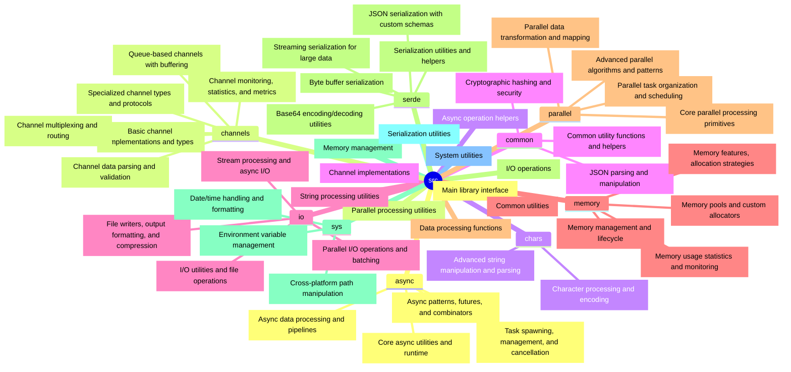

# trash_parallelism

[](https://opensource.org/licenses/Apache-2.0)

Azzybana Raccoon's comprehensive parallelism library.

## Table of Contents

- [Key Capabilities](#key-capabilities)
- [Performance Characteristics](#performance-characteristics)
- [Safety & Reliability](#safety--reliability)
- [Features](#features)
- [Usage](#usage)
- [Project Structure](#project-structure)
- [Dependencies](#dependencies)
- [Contributing](#contributing)
- [Authors](#authors)
- [License](#license)
- [Coverage Report](#coverage-report)

A high-performance Rust library providing comprehensive async, threading, memory management, and utility functions for building efficient applications. Built with performance and ergonomics in mind.

## Key Capabilities

- **Async Operations**: High-performance async utilities with smol, futures-lite, and crossfire
- **Threading**: Parallel processing with work-stealing schedulers and fork-join patterns
- **Memory Management**: Efficient allocation with mimalloc and custom memory pools
- **Channel Communication**: Advanced channel communication with monitoring and serialization
- **System Utilities**: Time handling, environment variables, file system operations
- **Data Processing**: Parsing, serialization, and data manipulation
- **I/O Operations**: File and network I/O with async support
- **Utilities**: Compression, hashing, JSON handling, and more

## Performance Characteristics

- **Zero-Copy Operations**: Where possible, avoids unnecessary allocations
- **Async-First Design**: Built for non-blocking I/O and concurrency
- **Memory Efficient**: Custom allocators and pooling reduce overhead
- **Parallel Processing**: Automatic parallelization for CPU-bound tasks
- **Monitoring**: Built-in performance tracking and statistics

## Safety & Reliability

- **Memory Safe**: All operations are memory-safe with no undefined behavior
- **Thread Safe**: Concurrent operations are properly synchronized
- **Error Handling**: Comprehensive error propagation with context
- **Resource Management**: Automatic cleanup and RAII patterns
- **Testing**: Extensive test coverage for reliability

## Features

### Core Modules

- **`parallel`** - High-performance parallel processing utilities with monitoring and async support
- **`async`** - Asynchronous operation helpers, task management, and concurrency utilities
- **`channels`** - Advanced channel implementations with monitoring, compression, and batching
- **`chars`** - String and character processing utilities with performance optimizations
- **`common`** - Shared utilities for hashing, serialization, and data manipulation
- **`data`** - Data processing and transformation functions
- **`io`** - File I/O operations with async support and performance monitoring
- **`memory`** - Memory management utilities with pools, monitoring, and optimization
- **`serde`** - Serialization utilities with JSON, base64, and custom formats
- **`sys`** - System-level utilities for environment, paths, and time handling

## Usage

### Basic Usage

```rust
use trash_parallelism::*;

// Async task spawning
# async fn example() -> Result<(), Box<dyn std::error::Error>> {
spawn_task!("my_task", async {
    println!("Hello from async task!");
    Ok(())
});
# Ok(())
# }

// Parallel processing
let data = vec![1, 2, 3, 4, 5];
let result = parallel_map(data, |x| x * 2);
assert_eq!(result, vec![2, 4, 6, 8, 10]);

// System utilities
let now = current_utc_time();
let home = read_env_var("HOME").unwrap_or_default();
println!("Current time: {}, Home: {}", now, home);
# }
```

### Advanced Example: High-Performance Data Processing

```rust,no_run
use trash_parallelism::*;
use smol;

// Parallel data processing pipeline
# smol::block_on(async {
let raw_data = vec![1u32; 10000];

// Process in parallel
let processed = parallel_map(raw_data, |x| x * x + 1);

// Serialize to JSON asynchronously
let json_data = serde::serialize_to_json(&processed).unwrap();

// Compress and save
let compressed = io::utils::compress_data_brotli(json_data.as_bytes(), 6).await.unwrap();
io::utils::write_file_async("processed_data.gz", &compressed).await.unwrap();

println!("Processed {} elements", processed.len());
# });
```

### Memory Management Example

```rust
use trash_parallelism::memory::*;

// Custom memory pool allocation
let pool_name = "processing_pool";
create_memory_pool(pool_name, 1024 * 1024).unwrap(); // 1MB pool

// Allocate from pool
let ptr = alloc_from_pool!(pool_name, 1024).unwrap();

// Use allocated memory safely
unsafe {
    std::ptr::write_bytes(ptr, 0, 1024); // Initialize to zero
}

// Pool automatically manages cleanup
```

### Channel-Based Communication

```rust,no_run
use trash_parallelism::channels::*;
use smol;

// Create monitored channel
# smol::block_on(async {
let (tx, rx, monitor) = create_monitored_channel::<String>(10);

// Send messages
for i in 0..5 {
    send_async(&tx, format!("Message {}", i)).await.unwrap();
}

// Receive and process
for _ in 0..5 {
    let msg = recv_async(&rx).await.unwrap();
    println!("Received: {}", msg);
}

// Check performance stats
let stats = monitor.get_stats();
println!("Processed {} messages", stats.messages_sent);
# });
```

## Project Structure


## Dependencies

Key external crates:
- `crossfire`: Channel communication
- `parking_lot`: Efficient synchronization primitives
- `smol`: Async runtime
- `smol-cancellation-token`: Cancellation for async tasks
- `futures-lite`: Lightweight futures utilities
- `serde`: Serialization framework
- `serde_json`: JSON serialization
- `schemars`: JSON schema generation
- `memchr`: High-performance string search
- `bytes`: Byte buffer management
- `ahash`: High-performance hashing
- `mimalloc`: Memory allocator
- `chrono`: Date and time handling
- `base64`: Base64 encoding/decoding
- `tempfile`: Temporary file creation
- `fork_union`: Thread pool and parallel execution
- `brotli`: Compression
- `arc-swap`: Atomic reference counting
- `once_cell`: Lazy initialization

## Contributing

1. Fork the repository
2. Create a feature branch
3. Add tests for new functionality
4. Ensure all tests pass
5. Submit a pull request

## Authors

- **Azzybana Raccoon** - *Initial work* - [GitHub](https://github.com/azzybana)

## License

This project is licensed under the Apache-2.0 License - see the [LICENSE](LICENSE) file for details.

## Coverage Report

Coverage Report
---------------

| Filename | Function Coverage | Line Coverage | Region Coverage |
|----------|-------------------|---------------|-----------------|
| *src\async\core.rs* | $\color{#00FF00}{\textbf{100.00\%}}$ (12/12) | $\color{#00FF00}{\textbf{100.00\%}}$ (36/36) | $\color{#00FF00}{\textbf{100.00\%}}$ (37/37) |
| *src\async\data.rs* | $\color{#00FF00}{\textbf{100.00\%}}$ (17/17) | $\color{#00FF00}{\textbf{100.00\%}}$ (54/54) | $\color{#FFFF00}{\text{97.83\%}}$ (90/92) |
| *src\async\patterns.rs* | $\color{#FFFF00}{\text{93.33\%}}$ (56/60) | $\color{#FFFF00}{\text{92.59\%}}$ (275/297) | $\color{#FFFF00}{\text{91.72\%}}$ (288/314) |
| *src\async\tasks.rs* | $\color{#FFA500}{\text{85.71\%}}$ (18/21) | $\color{#FFA500}{\text{88.04\%}}$ (81/92) | $\color{#FFA500}{\text{88.78\%}}$ (87/98) |
| *src\channels\core.rs* | $\color{#00FF00}{\textbf{100.00\%}}$ (21/21) | $\color{#FFFF00}{\text{95.35\%}}$ (123/129) | $\color{#FFFF00}{\text{95.83\%}}$ (161/168) |
| *src\channels\monitoring.rs* | $\color{#FFA500}{\text{87.50\%}}$ (14/16) | $\color{#FFA500}{\text{86.08\%}}$ (68/79) | $\color{#FFA500}{\text{87.36\%}}$ (76/87) |
| *src\channels\multiplexor.rs* | $\color{#FFA500}{\text{81.82\%}}$ (9/11) | $\color{#FFA500}{\text{83.33\%}}$ (65/78) | $\color{#FFA500}{\text{81.58\%}}$ (62/76) |
| *src\channels\parsers.rs* | $\color{#00FF00}{\textbf{100.00\%}}$ (15/15) | $\color{#FFFF00}{\text{98.91\%}}$ (91/92) | $\color{#FFFF00}{\text{95.31\%}}$ (122/128) |
| *src\channels\queue.rs* | $\color{#00FF00}{\textbf{100.00\%}}$ (6/6) | $\color{#FFFF00}{\text{97.50\%}}$ (39/40) | $\color{#FFFF00}{\text{98.39\%}}$ (61/62) |
| *src\channels\specialist.rs* | $\color{#FFFF00}{\text{94.00\%}}$ (47/50) | $\color{#FFA500}{\text{88.46\%}}$ (253/286) | $\color{#FFA500}{\text{81.64\%}}$ (369/452) |
| *src\chars\core.rs* | $\color{#FFFF00}{\text{91.30\%}}$ (21/23) | $\color{#FFFF00}{\text{94.53\%}}$ (121/128) | $\color{#FFFF00}{\text{96.12\%}}$ (198/206) |
| *src\chars\processing.rs* | $\color{#00FF00}{\textbf{100.00\%}}$ (8/8) | $\color{#00FF00}{\textbf{100.00\%}}$ (46/46) | $\color{#FFFF00}{\text{93.42\%}}$ (71/76) |
| *src\common\crypto.rs* | $\color{#00FF00}{\textbf{100.00\%}}$ (9/9) | $\color{#00FF00}{\textbf{100.00\%}}$ (41/41) | $\color{#FFFF00}{\text{95.83\%}}$ (69/72) |
| *src\common\json.rs* | $\color{#00FF00}{\textbf{100.00\%}}$ (6/6) | $\color{#FFFF00}{\text{97.56\%}}$ (40/41) | $\color{#FFFF00}{\text{94.03\%}}$ (63/67) |
| *src\common\utils.rs* | $\color{#FFA500}{\text{86.36\%}}$ (19/22) | $\color{#FFA500}{\text{85.71\%}}$ (90/105) | $\color{#FFA500}{\text{86.09\%}}$ (130/151) |
| *src\data.rs* | $\color{#00FF00}{\textbf{100.00\%}}$ (1/1) | $\color{#00FF00}{\textbf{100.00\%}}$ (10/10) | $\color{#00FF00}{\textbf{100.00\%}}$ (21/21) |
| *src\io\parallelism.rs* | $\color{#00FF00}{\textbf{100.00\%}}$ (12/12) | $\color{#FFA500}{\text{87.60\%}}$ (106/121) | $\color{#FFA500}{\text{80.67\%}}$ (121/150) |
| *src\io\streams.rs* | $\color{#FFFF00}{\text{97.06\%}}$ (33/34) | $\color{#FFFF00}{\text{98.52\%}}$ (200/203) | $\color{#FFFF00}{\text{94.20\%}}$ (211/224) |
| *src\io\utils.rs* | $\color{#FFFF00}{\text{97.14\%}}$ (34/35) | $\color{#FFFF00}{\text{93.71\%}}$ (134/143) | $\color{#FFFF00}{\text{91.35\%}}$ (190/208) |
| *src\io\writers.rs* | $\color{#FFFF00}{\text{94.29\%}}$ (33/35) | $\color{#FFFF00}{\text{95.65\%}}$ (154/161) | $\color{#FFA500}{\text{87.14\%}}$ (183/210) |
| *src\memory.rs* | $\color{#FFFF00}{\text{91.67\%}}$ (11/12) | $\color{#FFFF00}{\text{91.67\%}}$ (66/72) | $\color{#FFFF00}{\text{92.86\%}}$ (78/84) |
| *src\memory\features.rs* | $\color{#FFFF00}{\text{91.89\%}}$ (34/37) | $\color{#FFFF00}{\text{95.38\%}}$ (186/195) | $\color{#FFFF00}{\text{93.48\%}}$ (258/276) |
| *src\memory\manager.rs* | $\color{#FFA500}{\text{89.29\%}}$ (25/28) | $\color{#FFFF00}{\text{91.92\%}}$ (182/198) | $\color{#FFFF00}{\text{92.59\%}}$ (225/243) |
| *src\memory\pool.rs* | $\color{#FFFF00}{\text{90.91\%}}$ (20/22) | $\color{#FFA500}{\text{83.58\%}}$ (112/134) | $\color{#FFA500}{\text{89.89\%}}$ (169/188) |
| *src\memory\stats.rs* | $\color{#FFFF00}{\text{92.31\%}}$ (24/26) | $\color{#FFFF00}{\text{93.79\%}}$ (151/161) | $\color{#FFFF00}{\text{94.20\%}}$ (211/224) |
| *src\parallel\advanced.rs* | $\color{#FFA500}{\text{87.50\%}}$ (14/16) | $\color{#FFFF00}{\text{90.40\%}}$ (113/125) | $\color{#FFFF00}{\text{93.42\%}}$ (142/152) |
| *src\parallel\core.rs* | $\color{#00FF00}{\textbf{100.00\%}}$ (4/4) | $\color{#00FF00}{\textbf{100.00\%}}$ (25/25) | $\color{#00FF00}{\textbf{100.00\%}}$ (27/27) |
| *src\parallel\data.rs* | $\color{#00FF00}{\textbf{100.00\%}}$ (4/4) | $\color{#FFFF00}{\text{98.15\%}}$ (53/54) | $\color{#FFFF00}{\text{97.14\%}}$ (68/70) |
| *src\parallel\organize.rs* | $\color{#00FF00}{\textbf{100.00\%}}$ (4/4) | $\color{#FFFF00}{\text{96.77\%}}$ (30/31) | $\color{#FFFF00}{\text{97.37\%}}$ (37/38) |
| *src\serde\base64.rs* | $\color{#00FF00}{\textbf{100.00\%}}$ (4/4) | $\color{#00FF00}{\textbf{100.00\%}}$ (19/19) | $\color{#FFA500}{\text{88.89\%}}$ (24/27) |
| *src\serde\bytes.rs* | $\color{#00FF00}{\textbf{100.00\%}}$ (2/2) | $\color{#00FF00}{\textbf{100.00\%}}$ (9/9) | $\color{#FFFF00}{\text{90.91\%}}$ (10/11) |
| *src\serde\json.rs* | $\color{#00FF00}{\textbf{100.00\%}}$ (5/5) | $\color{#00FF00}{\textbf{100.00\%}}$ (21/21) | $\color{#FFFF00}{\text{92.59\%}}$ (25/27) |
| *src\serde\streaming.rs* | $\color{#00FF00}{\textbf{100.00\%}}$ (7/7) | $\color{#00FF00}{\textbf{100.00\%}}$ (41/41) | $\color{#FFA500}{\text{83.33\%}}$ (50/60) |
| *src\serde\utility.rs* | $\color{#00FF00}{\textbf{100.00\%}}$ (6/6) | $\color{#FFFF00}{\text{91.30\%}}$ (63/69) | $\color{#FFA500}{\text{87.50\%}}$ (91/104) |
| *src\sys.rs* | $\color{#00FF00}{\textbf{100.00\%}}$ (3/3) | $\color{#00FF00}{\textbf{100.00\%}}$ (13/13) | $\color{#00FF00}{\textbf{100.00\%}}$ (15/15) |
| *src\sys\datetime.rs* | $\color{#FFA500}{\text{83.33\%}}$ (10/12) | $\color{#FFFF00}{\text{93.94\%}}$ (31/33) | $\color{#FFA500}{\text{88.68\%}}$ (47/53) |
| *src\sys\env.rs* | $\color{#00FF00}{\textbf{100.00\%}}$ (12/12) | $\color{#00FF00}{\textbf{100.00\%}}$ (44/44) | $\color{#FFFF00}{\text{96.97\%}}$ (64/66) |
| *src\sys\path.rs* | $\color{#FFA500}{\text{88.89\%}}$ (24/27) | $\color{#FFFF00}{\text{95.31\%}}$ (122/128) | $\color{#FFFF00}{\text{90.50\%}}$ (181/200) |
| *test\async_test.rs* | $\color{#FFFF00}{\text{94.41\%}}$ (152/161) | $\color{#FFFF00}{\text{95.58\%}}$ (670/701) | $\color{#FFFF00}{\text{95.30\%}}$ (1035/1086) |
| *test\channels_test.rs* | $\color{#FFFF00}{\text{95.37\%}}$ (103/108) | $\color{#FFFF00}{\text{98.46\%}}$ (577/586) | $\color{#FFFF00}{\text{99.04\%}}$ (1140/1151) |
| *test\chars_test.rs* | $\color{#00FF00}{\textbf{100.00\%}}$ (23/23) | $\color{#00FF00}{\textbf{100.00\%}}$ (164/164) | $\color{#00FF00}{\textbf{100.00\%}}$ (343/343) |
| *test\common_test.rs* | $\color{#00FF00}{\textbf{100.00\%}}$ (25/25) | $\color{#00FF00}{\textbf{100.00\%}}$ (214/214) | $\color{#00FF00}{\textbf{100.00\%}}$ (432/432) |
| *test\data_test.rs* | $\color{#00FF00}{\textbf{100.00\%}}$ (16/16) | $\color{#00FF00}{\textbf{100.00\%}}$ (150/150) | $\color{#00FF00}{\textbf{100.00\%}}$ (347/347) |
| *test\io_test.rs* | $\color{#FFFF00}{\text{99.13\%}}$ (114/115) | $\color{#FFFF00}{\text{99.87\%}}$ (761/762) | $\color{#FFFF00}{\text{99.86\%}}$ (1476/1478) |
| *test\memory_test.rs* | $\color{#FFFF00}{\text{98.28\%}}$ (57/58) | $\color{#FFFF00}{\text{99.84\%}}$ (610/611) | $\color{#FFFF00}{\text{99.39\%}}$ (1314/1322) |
| *test\parallel_test.rs* | $\color{#00FF00}{\textbf{100.00\%}}$ (33/33) | $\color{#00FF00}{\textbf{100.00\%}}$ (142/142) | $\color{#00FF00}{\textbf{100.00\%}}$ (247/247) |
| *test\serde_test.rs* | $\color{#00FF00}{\textbf{100.00\%}}$ (27/27) | $\color{#00FF00}{\textbf{100.00\%}}$ (229/229) | $\color{#00FF00}{\textbf{100.00\%}}$ (364/364) |
| *test\sys_test.rs* | $\color{#00FF00}{\textbf{100.00\%}}$ (46/46) | $\color{#00FF00}{\textbf{100.00\%}}$ (281/281) | $\color{#00FF00}{\textbf{100.00\%}}$ (481/481) |
| *test\test.rs* | $\color{#FF0000}{\text{50.00\%}}$ (1/2) | $\color{#FF0000}{\text{66.67\%}}$ (10/15) | $\color{#FF0000}{\text{58.82\%}}$ (10/17) |
| Totals | $\color{#FFFF00}{\text{95.39\%}}$ (1201/1259) | $\color{#FFFF00}{\text{96.05\%}}$ (7116/7409) | $\color{#FFFF00}{\text{95.75\%}}$ (11521/12032) |

##### Generated by llvm-cov -- llvm version 21.1.2-rust-1.92.0-nightly
